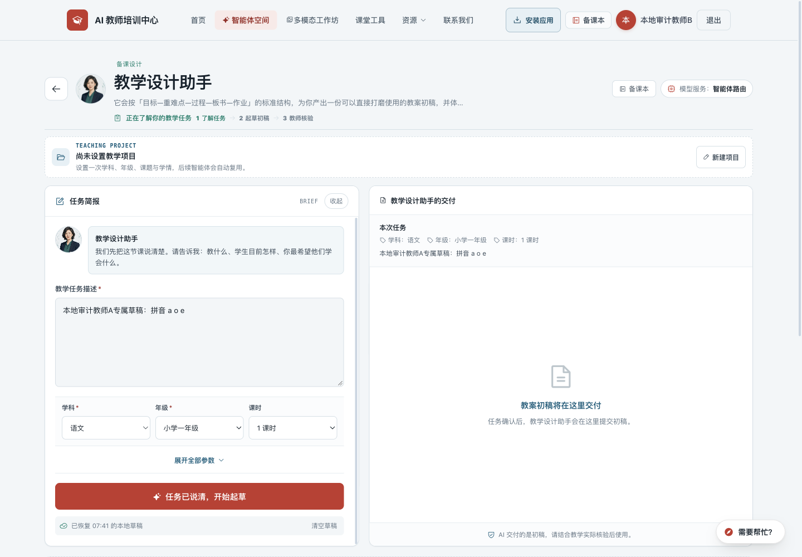
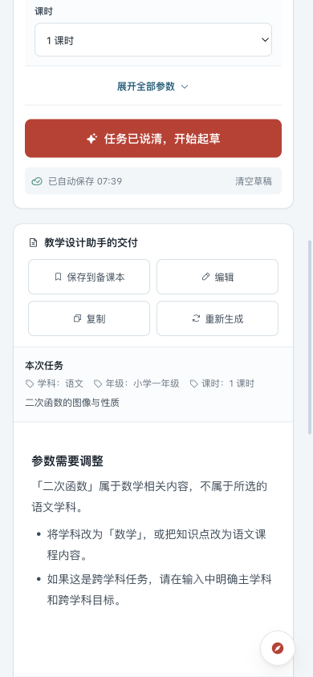
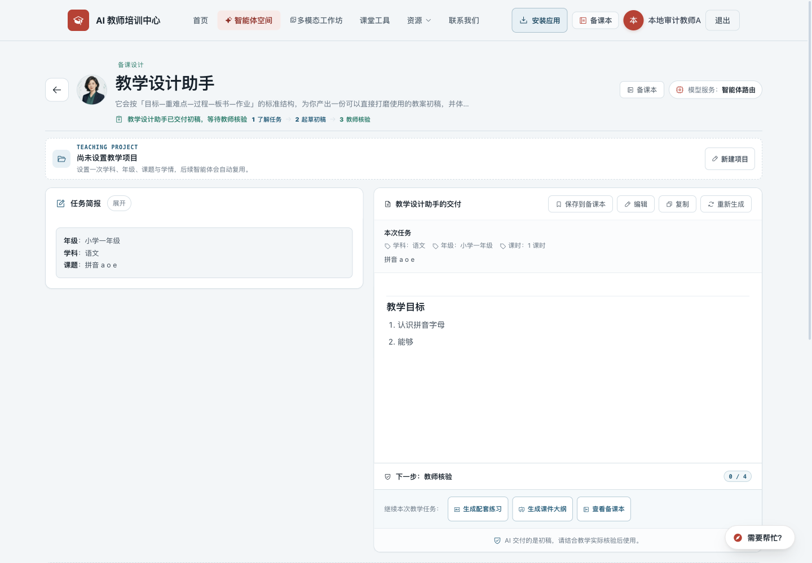

# 教师培训网站：运行、体验与视觉检查

检查日期：2026 年 9 月 21 日（北京时间）
项目：AI 教师培训中心 · 本地版本 `a33e07a`
线上检查地址：[ai.teachailab.com](https://ai.teachailab.com/)
本次交付：检查报告与截图证据。未修改网站代码，未发布。

## 1. 总体判断

网站的基础结构和主要页面能够正常运行。现有红色品牌、教学任务分类、数字教师形象、备课本的阅读样式都有保留价值。当前最需要处理的是生成过程与草稿保护，然后是手机操作效率和内容质量；整体重做视觉的收益低于先修这些具体问题。

共整理 **20 项问题与改进建议：5 项 P1、12 项 P2、3 项 P3**。其中既有已复现的功能故障，也有基于界面证据的体验建议，不能把它们都理解为线上故障。

- **P1：优先修复。** 影响主要功能、已有成果或同设备账号隔离。
- **P2：下一批完善。** 影响使用效率、学习连续性、内容可信度或运营判断。
- **P3：按产品方向选择。** 视觉打磨、资讯定位与进一步性能优化。

证据标记：**线上实测**＝在公开网站实际操作；**本地复现**＝真实前端/接口代码配合合成账号与模拟响应；**代码确认**＝从实现与规则发现矛盾，尚未在真实登录账号下提交验证；**体验判断**＝截图与操作观察支持的设计建议。

## 2. 检查覆盖与边界

| 检查项 | 实际覆盖与结果 |
| --- | --- |
| 桌面与手机页面 | 首页、智能体、多模态、课堂工具、AI 工具、资源、资讯、学习路径、文章列表、提示词、备课本，共 11 个主要页面；桌面 1440×1000、手机 390×844 |
| 页面基础表现 | 上述手机页面未发现整页横向溢出；抽查可见图片正常加载；公开页面可以打开 |
| 智能体 | 19 个工作区本地逐一打开，17 个表单型、2 个对话型；测试必填、学段冲突、成功生成、编辑保存、失败重试、截断响应与重复提交 |
| 课堂工具 | 9 个工具逐一打开；实操倒计时、随机点名、小组计分、随机分组、座位交换；点名使用虚构姓名，未操作真实学生名单 |
| 多模态 | 下方案例详情可打开关闭；音频预览载入正常，时长约 20 秒；主推案例按钮发现故障；未评估实际扬声器音质 |
| 阅读与账户入口 | 文章详情可阅读；学习步骤、提示词复制、联系我们的游客限制已检查；登录弹窗 Escape 关闭正常 |
| 离线 | 已访问并缓存的课堂工具页面在断网后可重新打开；这不代表在线 AI 或全部页面都能离线使用 |
| 项目自动检查 | `npm run check` 通过：站点 11 个公开页面 / 13 个应用页面检查、课程约束 13 个场景、函数 57 项断言、腾讯云适配 8 项断言 |
| 线上回归脚本 | `node scripts/check-production.mjs https://ai.teachailab.com/`：95 项断言通过 |

**未覆盖的部分：**真实账号的注册、邮件/手机账户恢复、真实云端保存和跨账号云数据权限、管理后台实际增删改、真实模型输出质量与计费、麦克风采集、原生 Word/PDF 打开与打印、真机 Safari/微信浏览器。没有调用付费模型，没有向生产站提交测试作品、订阅邮箱或联系留言。登录后生成及保存界面的检查使用本地合成数据，因此报告不会把这些结果表述成真实云端端到端验收。

本报告是功能和产品体验检查，不是完整安全审计或无障碍合规认证。自动检查通过说明现有断言成立，不能覆盖本次发现的所有交互状态。

## 3. 教师使用旅程中出现的问题

| 使用步骤 | 当前表现 | 关联问题 |
| --- | --- | --- |
| ① 找到教学任务 | 手机首屏被介绍与筛选占用；照搜索框例句输入也可能无结果 | F06、F11 |
| ② 了解并准备输入 | 从目录点任务先要求登录，直接链接却可预览；学习内容展开也被登录拦截 | F09 |
| ③ 生成教学材料 | 手机端隐藏按钮失效，可重复生成；等待缺乏取消；截断响应被当作完成 | F02、F04 |
| ④ 修改与重试 | 再次生成失败会清掉已有结果；同浏览器切换账号可能恢复另一人的本地草稿 | F01、F03 |
| ⑤ 收藏、复用、继续备课 | 已保存作品缺少直接修改入口；继续操作未携带所选作品上下文 | F10、F12 |
| ⑥ 持续学习与求助 | 文章类别大量为空、路径材料不够对应；订阅与手机号恢复存在流程矛盾 | F07、F08、F14、F15 |

## 4. 优先修复：5 项 P1

### F01 · 同一设备上，草稿没有正确按账号隔离

**证据：本地复现 + 代码确认。工作量：中。**

草稿模块从 `window.Auth` 或 `window._currentUser` 读取用户，但实际认证脚本使用顶层 `const Auth` 和 `let _currentUser`，没有把它们挂到 `window`。本地检查中，认证 getter 返回 `audit-a`，草稿模块却返回 `guest`。

复现：合成教师 A 填写专属草稿，切换合成教师 B，再打开同一工作区，仍恢复 A 的文字。下图的登录名是 B，输入框保留 A 的专属文本。**风险限于同一浏览器的本地草稿/项目数据；本次没有发现或验证云端作品跨账号泄露。**

**建议方案：**建立唯一的认证状态读取接口，草稿键使用真实 UID；退出和切换账号时清空当前界面并重新加载所属草稿。旧 `guest` 数据不能静默归入任意新登录用户，应提供明确的认领或清理方式。

**验收：**A/B 切换、退出后游客浏览、游客再登录三个场景都不能自动显示他人草稿；刷新和重新打开自己的任务仍能恢复。

定位：`js/teaching-projects.js:11–21`，`js/auth.js:147`，`js/firebase-config.js`。

### F02 · 手机端在不应出现时显示结果操作，可重复发起生成

**证据：线上实测 + 本地复现。工作量：中。**

手机样式的 `display: grid !important` 覆盖了脚本的 `display:none`，导致尚未生成、校验失败和生成中仍显示保存、编辑、复制、重新生成按钮。线上故意输入学段冲突内容被正确拦截，但这些按钮仍然出现。本地给接口增加延迟，先点主生成按钮，再点仍可用的重新生成，记录到 **2 次生成请求**。

**建议方案：**把“未生成 / 生成中 / 成功 / 失败”的显示和可操作性集中管理，移除覆盖隐藏状态的样式；所有生成入口共用请求锁。只有存在可用结果时显示保存/编辑/复制。

**验收：**快速连点、不同入口交替点击都只能有一个有效请求；空结果无法保存；错误和等待状态按钮一致。修复后回归桌面端与手机端。

定位：`agents.html:354`、`:1468`、`:2408`。

### F03 · 再次生成失败会丢掉上一份成功结果

**证据：本地复现 + 代码确认。工作量：中。**

复现：先生成一份有效教案，再重新生成，让模拟接口返回 502。界面换成错误提示，保存到本地的结果字段也变成空字符串。错误提示却仍说输入和已有草稿已保存，会让教师误以为旧版本还在。

**建议方案：**在新请求成功前保留上一份结果及教师修改；将“本次尝试失败”显示为独立提示，支持返回上一版。新版本完整到达后再替换，不在请求开始时清空正式草稿。

**验收：**断网、502、超时、取消都不丢失上一次成功内容和手工编辑；刷新后仍可找回。

定位：`agents.html:2393`、`:2441` 及错误后的草稿持久化逻辑。

证据：[重新生成失败界面](screenshots/35-local-regeneration-error.png)。该错误界面的重试图标还受到占位图标大字号样式影响，建议随错误状态一起调整。

### F04 · 流式响应中途断开，会被当作完整结果；等待缺少取消

**证据：真实接口代码的本地故障注入 + 本地界面复现。工作量：中至大。**

后端读取上游流时吞掉异常，并正常关闭下游。用真实接口函数模拟“先返回一段文字，再断流”，下游仍得到 HTTP 200 和半段正文，没有错误信号。前端也把只写到“2. 能够”的示例判定为“已交付初稿，等待教师核验”，并开放保存。生成链路同时缺少明确的首字/空闲超时和用户停止操作。

**建议方案：**流协议区分内容片段、完成和错误；只有收到明确完成标记才显示完成。中断时保留部分文本并标注“未完成”，提供重试；加入停止生成、首字超时与空闲超时，并向上游传递取消信号。与 F03 的版本保留一起设计。

**验收：**首字前失败、输出中断、永不结束、主动取消、正常结束五类状态可以被可靠区分；部分内容不被自动标为完整交付。

定位：`functions/api/agent.js:93–110`、`:407–430`，`agents.html:2940` 起。机器可读证据：[断流测试结果](stream-disconnection-evidence.json)。

### F05 · 多模态工作坊的主推案例按钮无效

**证据：线上实测 + 代码确认。工作量：小。**

点击页面顶部“古诗意境导入图”主推案例，控制台报 `ReferenceError: openCaseModal is not defined`，没有打开案例。原因是这里调用 `openCaseModal('poem-image')`，实际函数名为 `openCase`。下方卡片的“看步骤”能正常打开同一类详情。

**建议方案：**统一为现有正确的打开函数或共用事件入口，主卡与列表卡共用相同案例数据。

**验收：**主卡点击和键盘 Enter 都能打开指定案例；关闭后焦点回到原按钮。

定位：`multimodal.html:220`、`:650`。证据：[主推区域](screenshots/05-multimodal-desktop.png)、[可正常打开的下方案例详情](screenshots/37-multimodal-detail.png)。

## 5. 流程、内容和运营：12 项 P2

| 编号 | 问题、证据与影响 | 建议方案与验收 | 工作量 |
| --- | --- | --- | --- |
| **F06** | **任务搜索与提示不匹配。** 线上输入搜索框建议的“设计一场小组活动”，返回 0 项，尽管已有课堂活动设计助手。代码只做完整字符串包含匹配。 | 加关键词拆分、任务同义词与简易排序；例句可点击试用；无结果时展示接近任务。验收以页面提供的全部示例及教师常用说法为准，无需增加模型费用。定位 `agents.html:1217`。[截图](screenshots/24-agent-search-empty.png) | 小至中 |
| **F07** | **邮箱登记存在权限逻辑冲突。** 代码先查询 subscribers 去重，仓库规则却仅允许管理员读取。按当前仓库规则，普通登录用户查询会被拒绝，无法进入新增步骤。未向生产提交邮箱，未核实生产所部署规则。 | 通过服务端完成去重和登记，不开放邮箱列表读取权限；提示明确是“登记待通知”还是已经提供邮件服务。验收普通用户首次登记、重复登记、未登录和网络失败。定位 `js/data.js:836`、`js/auth.js:815`、`firestore.rules:213`。 | 中 |
| **F08** | **手机号账号的恢复求助入口形成循环。** 密码恢复实现告诉手机账号用户“联系我们”，而游客点击“联系我们”实际打开注册/登录窗口；忘记密码页面只提供邮箱输入。 | 为未登录用户提供可访问的账号恢复说明与支持渠道，采用独立身份核验流程；手机登录旁明确展示恢复入口。验收忘记手机账号密码的用户可在不登录的情况下发起求助。定位 `js/auth.js:159`、`js/assistant.js:591`。 | 中 |
| **F09** | **预览、学习、复制的登录门槛不一致。** 线上从目录点任务被要求登录，直接进入任务链接却可看表单；学习路径写“登录后记录进度”，实际展开步骤也要求登录；公开可读的提示词点击复制又要求登录。 | 建议允许公开内容阅读、任务表单预览和官方提示词复制；在 AI 生成、个人保存、进度同步、投稿时登录。若保留门槛，应提前准确说明，并在登录后自动继续刚才的动作。定位 `paths.html:345`、`prompts.html:183`。[目录登录门槛](screenshots/25-directory-login-gate.png) | 中 |
| **F10** | **备课本缺少保存后的修改与继续流程。** 本地作品详情可阅读/导出，但没有直接修改正文入口。“继续用该智能体”只进入 `/agents#智能体ID`，没有携带选中作品 ID 或正文，不能保证继续的是这一份作品。 | 增加“编辑此作品”“以此为基础继续”，把选中正文与原始输入显式带入，保存为新版本或明确覆盖；教师核验状态可更新。验收旧作品 A 在已有任务草稿 B 时继续，加载的必须是 A。定位 `workspace.html:1533`、`functions/api/works.js`。[作品详情](screenshots/33-local-work-detail-desktop.png) | 中至大 |
| **F11** | **手机首屏用于介绍和筛选的空间过多。** 智能体首个可用任务、工具页首个工具都靠近或低于首屏下缘；学习路径先堆叠三张大卡；课堂工具大卡单列滚动较长。页面没有横向溢出，但找任务仍慢。 | 手机标题和介绍压缩；成员索引改成可展开；筛选合并为一行滚动标签；工具使用紧凑列表或合适的双列。目标是在 390×844 首屏看到搜索和至少一个可直接执行的任务，不能靠缩小字体达成。[智能体](screenshots/14-agents-mobile.png) / [工具](screenshots/16-tools-mobile.png) / [路径](screenshots/19-paths-mobile.png) | 中 |
| **F12** | **手机生成结果阅读区拥挤。** 输出标题、操作、说明占据固定高度面板的大部分空间，正文形成小窗口和内外两层滚动；不利于读完整教案。 | 手机上正文随内容自然伸展，或提供“展开阅读”视图；摘要/核验说明可折叠；保存、复制放在不遮正文的工具栏。验收长教案、表格、编辑和屏幕键盘打开时都能连续阅读。[结果区](screenshots/31-local-result-mobile.png) | 中 |
| **F13** | **工具目录出现重复和信息缺失。** 线上“蝉镜AI数字人”重复两次，缺少费用/语言等标签并归到“更多工具”。这些标签依赖按名称写死的 `TOOL_META`，新增内容无法完整继承。 | 用稳定 ID 和规范网址去重；任务、语言、费用、审核日期作为可维护的数据字段；空分类自动隐藏。验收新增工具后分类和标签完整、同名相同链接不重复。定位 `tools.html:181` 起。[重复卡片](screenshots/29-tools-duplicate-mobile.png) | 中 |
| **F14** | **学习路径与配套内容连接薄弱。** 当前 3 篇文章都属“实战技巧”，其余四类为空；部分“阅读配套实践文章”只去文章总列表，找不到对应步骤材料。学习进度存在本机 localStorage，不是跨设备云同步。 | 暂时隐藏空类或给出下一步推荐；每个路径步骤关联具体材料与一个可交付练习；明确进度仅存本机，或之后增加账号同步。验收每一步都能直达相关示例，空状态有有效去向。定位 `paths.html:226–270`。[空分类](screenshots/38-empty-article-category.png) | 中 |
| **F15** | **内容表达需要证据与边界。** 页面有“歌曲记忆遗忘慢 3–5 倍”“2 小时教研抵半学期”等未显示来源的效果判断；部分模板鼓励填真实姓名；素材描述使用“无版权限制”等绝对表述。这里指出的是内容缺少依据与限定，未作具体授权法律判断。 | 无依据的效果改为目标或场景示例，有数据则标出处和条件；示例统一用化名；素材卡链接各平台当前官方许可和适用范围；建立内容审核日期。验收每个量化效果都有依据或被改写。定位 `js/data.js:72`、`:78`、`:97`、`:100`、`:385–387`。 | 中，需内容审核 |
| **F17** | **部分课堂工具的键盘与读屏支持不足。** 白板颜色/笔宽按钮无可理解名称；座位格是无 tabindex、无按钮语义的可点击 div；手机 6 列座位单格约 39px，长姓名截断。部分表单也缺少明确标签。 | 为按钮补名称和选中状态；座位支持键盘选中/交换，手机提供横向座位画布或缩放并保留完整姓名查看；输入项补 label，动态结果提示状态。验收仅用键盘完成设置和交换，再做读屏抽查。此项不等同全站 WCAG 认证。[座位表](screenshots/26-seating-mobile.png) | 中 |
| **F18** | **统计数据存在归类和身份丢失风险。** 埋点也使用 `window.Auth`，本地已登录合成用户事件仍无身份；路径识别只匹配 `.html`，线上 `/agents` 等会归到 site；关闭安装提示产生的事件在线返回 400。 | 统一认证读取；同时规范化无后缀和 `.html` 路径；前后端事件名单一致，并记录失败。验收登录/游客、主要入口、生成/保存、安装提示关闭均正确归类，不重复计数。定位 `js/analytics.js:43–72`、`functions/api/analytics.js`。 | 中 |

## 6. 按方向选择：3 项 P3

### F16 · 资讯应更贴近教师任务

**证据：线上内容观察。工作量：中，持续编辑投入另计。**

默认资讯里混有汽车销售、企业动态等内容，和备课、教学评价、教师成长的直接关系较弱。页面看起来更新频繁，但教师需要自己筛选价值。[当前资讯截图](screenshots/08-news-desktop.png)

建议默认提供“课堂实践 / 教研方法 / 教育政策 / 工具变化”栏目，每条增加简短的教师用途说明并保留原文链接；综合 AI 新闻作为可选栏目。先用少量人工精选验证使用价值，不必立即增加自动摘要模型成本。

### F19 · 保留品牌，统一视觉层级与阅读体验

**证据：桌面与手机截图对照。工作量：中；建议先选方向，再逐页调整。**

当前红色品牌和偏纸面阅读感适合教育场景，建议保留。问题是不同页面的标题尺度、斜体强调、卡片密度、小字与操作层级不够一致；头像、介绍和装饰有时比教学任务更抢眼。

| 视觉部位 | 观察 | 建议调整 | 判断改善的标准 |
| --- | --- | --- | --- |
| 首页与列表首屏 | 首页介绍较高，桌面右侧留白较大；手机主要内容出现偏晚 | 压缩介绍高度，首屏突出“我要备课 / 出题 / 做课件”等已有任务入口；保留清晰留白 | 用户无需先阅读长介绍即可开始；手机首屏有真实操作 |
| 字号与颜色 | 部分辅助文字很小且颜色浅，标题与说明比例差距过大 | 建立少量统一字号；正文约 15–16px、说明约 12–13px，关键操作不使用弱对比；对真实配色做对比度检查 | 普通浏览与 200% 放大时仍清楚；不用缩小字体换密度 |
| 智能体卡片 | 人物识别突出，任务与交付物信息相对分散 | 保留人物但缩减手机头像占比，突出“适用任务、输出什么、开始” | 看卡片即可判断能否解决当前任务 |
| 结果与错误状态 | 信息框较多，手机正文拥挤；错误重试图标异常大 | 以正文为中心，说明次级；统一按钮高度、图标 16–20px 和加载/错误样式 | 状态变化不跳成另一套布局，错误提示仍有清晰下一步 |
| 文章阅读 | 大面积深色通用封面后连续出现两次相同大标题，正文被推到下方 | 封面改为主题相关的小型示意或真实教学产物预览；正文去掉重复一级标题 | 打开文章更快看到实质内容，标题层级清晰 |
| 安装提示 | 首次访问较早出现的底部浮层会遮住部分任务内容 | 在首次完成任务后或回访时轻提示，保留导航中的主动安装入口 | 新用户首次任务不被遮挡，提示可关闭并尊重选择 |

证据：[首页](screenshots/01-home-desktop.png)、[智能体桌面](screenshots/03-agents-desktop.png)、[手机智能体](screenshots/14-agents-mobile.png)、[文章重复标题](screenshots/39-article-reading.png)、[错误样式](screenshots/35-local-regeneration-error.png)。

**建议选择的整体方向：**“清晰的教师工作台”。保留现有红色标识与人物，减少大标题和装饰占高，把任务、填写、结果、保存做成一致的操作语言。此处是方向建议，尚未生成新视觉稿或修改页面。

### F20 · 减少公共页无效请求和媒体预加载

**证据：浏览器请求观察 + 代码确认。工作量：中。**

公共页面仍普遍加载认证/Firestore 相关脚本；多模态列表会为波形读取整段音频，并较早请求视频元信息；多个页面的 pageCopy 请求 404 后再使用默认文案，虽然页面可用，但增加错误噪声和回退路径。

一次首页加载观察到文档首字节约 0.95 秒、DOMContentLoaded 约 1.81 秒、load 约 2.02 秒；后续页面受缓存和 Service Worker 影响。这些仅是本次浏览器样本，**不能作为全国移动网络表现、Lighthouse 分数或性能百分位**。本次没有证据表明需要整体重构。

建议预生成音频波形，媒体按接近可见或用户操作延迟加载；公共数据走轻量公共接口，对个人能力按需初始化；文案“未配置覆盖值”使用明确的正常返回语义。验收应在固定设备、清缓存、固定网络条件下重复比较请求数、传输量和首屏可操作时间。

定位：`multimodal.html:487–542`、公共脚本引用、`js/site-copy.js` 与 `/api/content` 回退逻辑。

## 7. 建议实施顺序，供你决定

| 批次 | 建议范围 | 预期结果 | 决策说明 |
| --- | --- | --- | --- |
| **A · 核心可靠性** | F01–F05 | 草稿不串账号、不因失败丢失，不重复生成，完整/中断状态明确，主推案例可点 | 优先建议；包含前后端改动，F04 与 F03 应配套回归 |
| **B · 使用更顺畅** | F06、F08–F12、F17 | 找任务、预览、生成、阅读、继续修改构成连续流程 | 需要确定公开内容的登录门槛；不必等待大改版 |
| **C · 内容与运营可信度** | F07、F13–F16、F18 | 分类不空转，工具不重复，描述有依据，统计能反映真实使用 | 一部分是代码，一部分是持续编辑工作 |
| **D · 统一视觉与加载** | F19、F20 | 保留品牌，统一层级，手机首屏紧凑，减少非必要加载 | 先确认“教师工作台”方向，再做首页、智能体、结果页三页样式样板 |

建议先做 **A + F06**，再处理手机端的 **F11、F12**。如果这次只想改善外观，可以先确认 F19 的方向，但这不能替代生成和草稿问题的修复。本报告中的小/中/大是相对改动范围，不是工期或费用承诺。

## 8. 证据图册

所有截图都来自本次检查；带“本地”字样的使用虚构教师与示例内容。截图没有经过视觉修饰。点击图片链接可查看原图。

| 编号 | 页面或状态 | 环境 |
| --- | --- | --- |
| 01 | [首页桌面与安装浮层](screenshots/01-home-desktop.png) | 线上 |
| 02 | [任务表单直接链接预览](screenshots/02-task-preview-desktop.png) | 线上 |
| 03 | [智能体桌面](screenshots/03-agents-desktop.png) | 线上 |
| 04 | [工具目录桌面](screenshots/04-tools-desktop.png) | 线上 |
| 05 | [多模态桌面](screenshots/05-multimodal-desktop.png) | 线上 |
| 06 | [课堂工具桌面](screenshots/06-classroom-tools-desktop.png) | 线上 |
| 07 | [资源桌面](screenshots/07-resources-desktop.png) | 线上 |
| 08 | [资讯桌面](screenshots/08-news-desktop.png) | 线上 |
| 09 | [学习路径桌面](screenshots/09-paths-desktop.png) | 线上 |
| 10 | [文章列表桌面](screenshots/10-articles-desktop.png) | 线上 |
| 11 | [提示词桌面](screenshots/11-prompts-desktop.png) | 线上 |
| 12 | [游客备课本登录提示](screenshots/12-workspace-desktop.png) | 线上 |
| 13 | [首页手机](screenshots/13-home-mobile.png) | 线上 |
| 14 | [智能体手机](screenshots/14-agents-mobile.png) | 线上 |
| 15 | [任务表单手机](screenshots/15-agents-lesson-design-mobile.png) | 线上 |
| 16 | [工具目录手机](screenshots/16-tools-mobile.png) | 线上 |
| 17 | [多模态手机](screenshots/17-multimodal-mobile.png) | 线上 |
| 18 | [课堂工具手机](screenshots/18-classroom-tools-mobile.png) | 线上 |
| 19 | [学习路径手机](screenshots/19-paths-mobile.png) | 线上 |
| 20 | [提示词手机](screenshots/20-prompts-mobile.png) | 线上 |
| 21 | [资源手机](screenshots/21-resources-mobile.png) | 线上 |
| 22 | [资讯手机](screenshots/22-news-mobile.png) | 线上 |
| 23 | [文章列表手机](screenshots/23-articles-mobile.png) | 线上 |
| 24 | [任务搜索例句无结果](screenshots/24-agent-search-empty.png) | 线上 |
| 25 | [从目录进入任务的登录门槛](screenshots/25-directory-login-gate.png) | 线上 |
| 26 | [手机座位表](screenshots/26-seating-mobile.png) | 线上 |
| 28 | [手机校验失败后的结果按钮](screenshots/28-validation-actions-mobile.png) | 线上 |
| 29 | [重复的数字人工具卡片](screenshots/29-tools-duplicate-mobile.png) | 线上 |
| 30 | [合成账号切换后恢复前一账号草稿](screenshots/30-local-draft-account-switch.png) | 本地 |
| 31 | [手机生成结果阅读区](screenshots/31-local-result-mobile.png) | 本地 |
| 32 | [示例作品列表](screenshots/32-local-workspace-desktop.png) | 本地 |
| 33 | [示例作品桌面详情](screenshots/33-local-work-detail-desktop.png) | 本地 |
| 34 | [示例作品手机详情](screenshots/34-local-work-detail-mobile.png) | 本地 |
| 35 | [重新生成失败](screenshots/35-local-regeneration-error.png) | 本地 |
| 36 | [部分内容被标记交付](screenshots/36-local-partial-result.png) | 本地 |
| 37 | [可正常打开的多模态详情](screenshots/37-multimodal-detail.png) | 线上 |
| 38 | [空文章分类](screenshots/38-empty-article-category.png) | 线上 |
| 39 | [文章封面与重复标题](screenshots/39-article-reading.png) | 线上 |

截图 27 是重复的校验过程截图，已用信息更完整的 28 替代，不作为交付保留。
