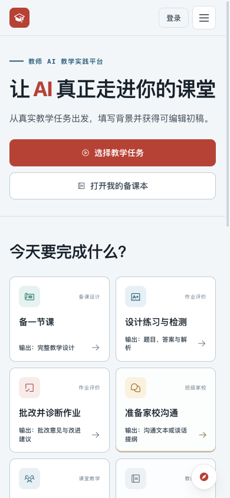
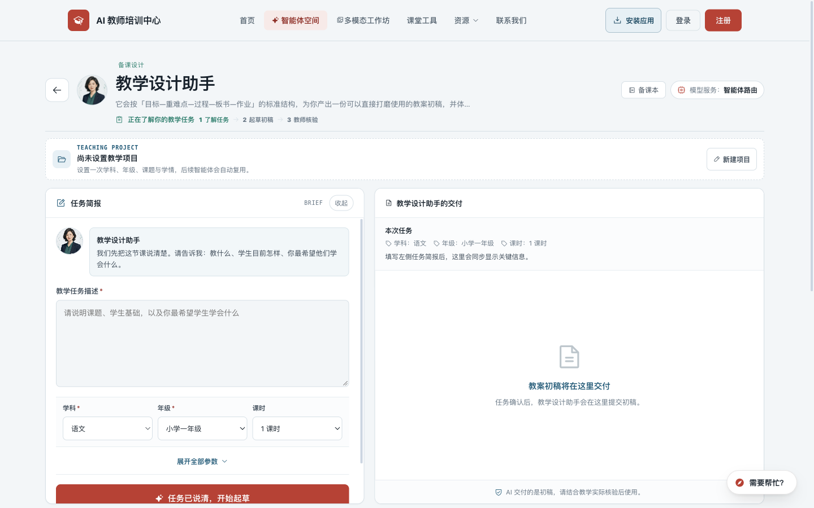
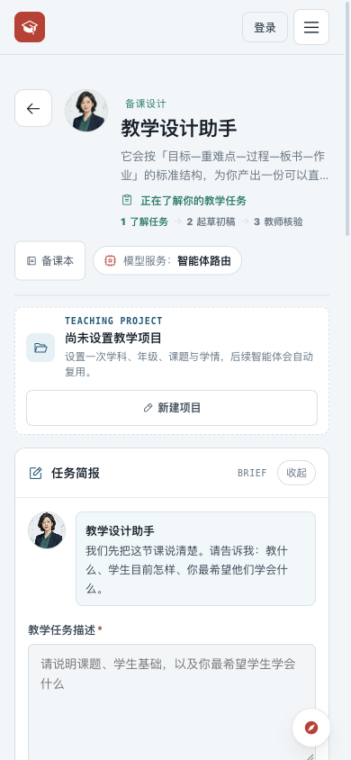
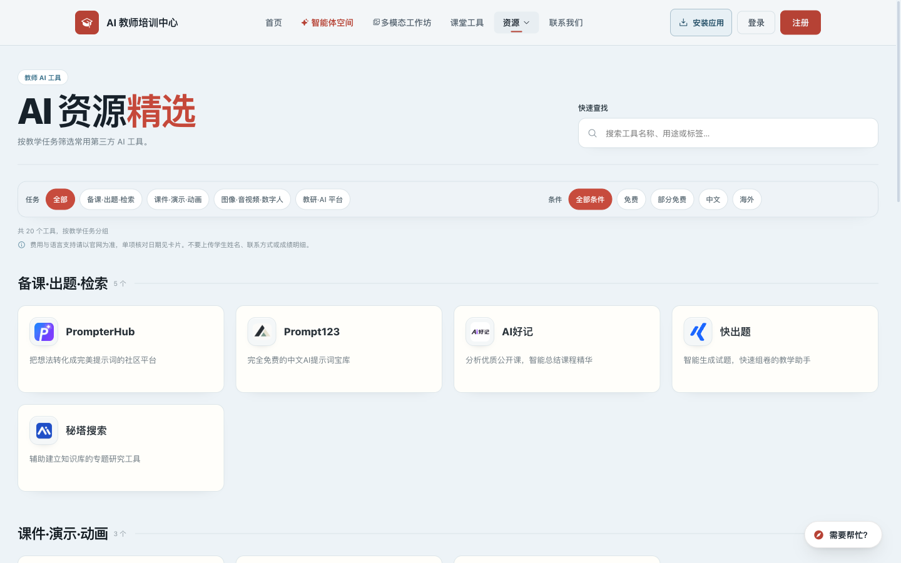
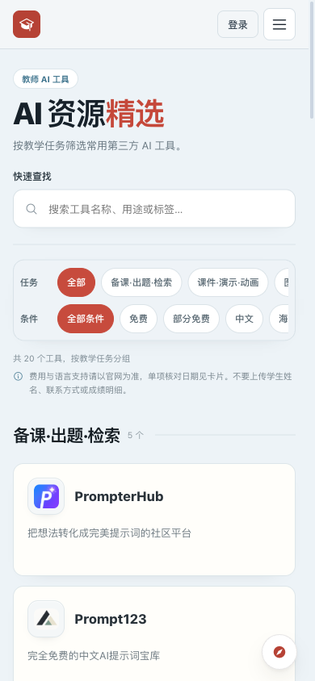
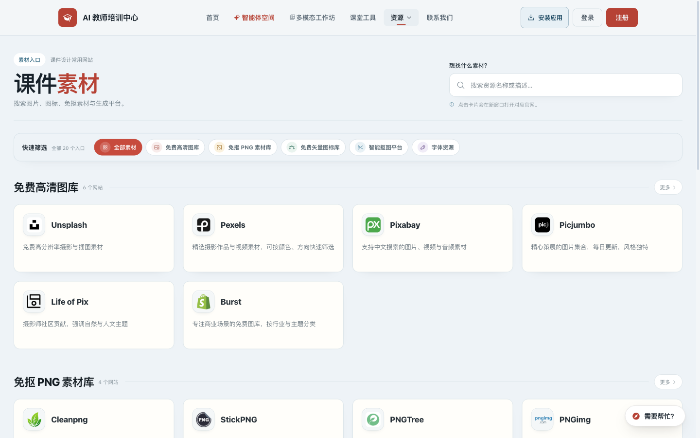
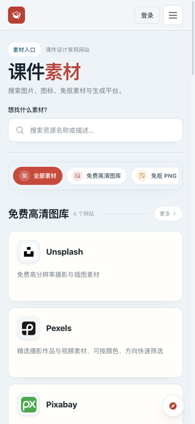
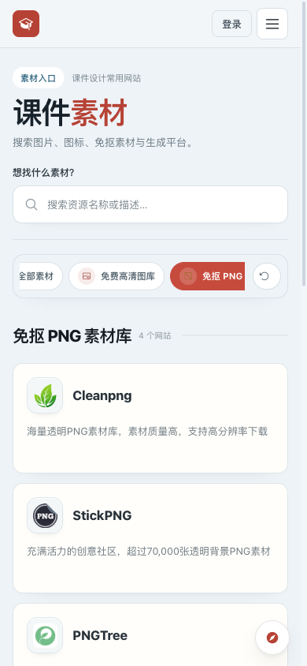
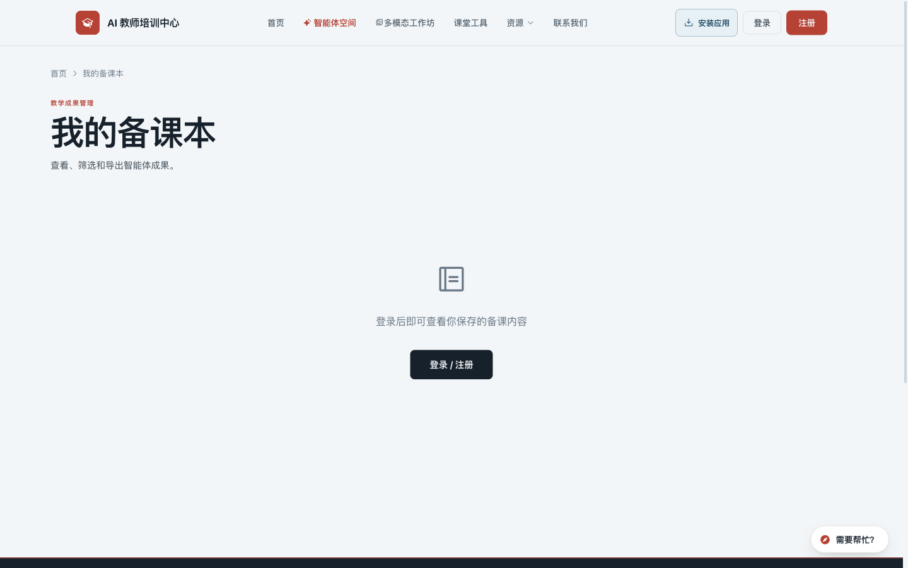
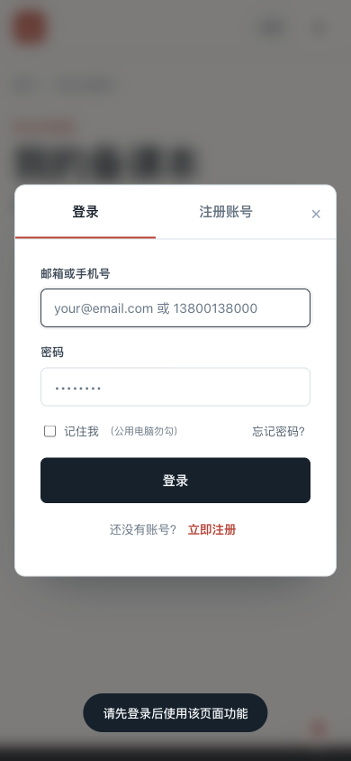

# 生产站视觉检查证据

2026-09-27，北京时间约 19:46–19:51。站点：<https://ai.teachailab.com/>。

桌面 1440×900；手机宽度模拟 390×844；未登录。每张最终截图均在保存后打开核对。以下六步是审查顺序，工具与素材属于从主流程分出的资源浏览场景。

完整实施建议见[优化方案](../2026-09-27-design-review.md)。

## 1. 首页：整体良好，局部减轻提示遮挡

任务卡在桌面和手机首屏均可见。标题、主要按钮、任务名称有清楚层级；原先“必须重做首屏”的倾向降级为小幅精简。手机任务卡辅助文字偏小，但不是任务入口缺失。

桌面截图保留了本次初次访问出现的应用更新提示：它遮挡左下任务区。随后点击“稍后”关闭，继续检查。建议收窄提示，避免压住任务入口。

## 2. 智能体目录：桌面偏重，手机基本清晰

人物形象、角色分工和不同部门的配色形成了辨识度，应保留。桌面肖像较高，操作入口靠近或超出 900px 视口下沿，先压缩桌面顶部说明和肖像。手机两列卡片已经能展示功能名、结果说明及“开始协作”，不需要同步大幅缩图。

部分徽标/分类文字很小，可降低重复信息密度，把结果说明与动作放在更高层级。分类按钮在手机上横向滚动，需明确还有更多分类。

## 3. 教学设计简报：桌面可用，手机需要优先精简

通过点击“与教学设计助手开始协作”进入，未登录也能查看任务简报，这是可保留的体验。桌面输入与交付分区清楚，但介绍、项目区和重复开场话占据较大高度，主要按钮在 900px 视口底部接近被截断。

手机问题更明显：输入框顶部约 y=715px，生成按钮约 y=1189px；此前有身份介绍、进度、备课本与模型标识、未设置项目、助手开场话。任务输入字号 13.5px，学科/年级选择框为 12.5px。“收起”按钮约 28px 高。

建议合并身份/开场说明，把未设置项目折叠成可选背景入口，核心任务输入前移，手机表单使用 16px 字号。当前“模型服务：智能体路由”对教师不能直接提供决策帮助，可收进详情。不要改动课程匹配和教师核验规则。

未输入任务、未点击生成，故没有评估模型输出、错误恢复或保存状态。

## 4. AI 资源精选：布局统一，可读性及提示需修正

正式数据加载完成后为 20 个可见工具，Logo 正常。初始加载中的截图已经替换，不能据其短暂空白认定 Logo 故障。

卡片正文实际 12.7px，颜色 `rgb(110,122,130)`，背景 `rgb(255,254,250)`，对比度约 4.36:1。说明文字 10.5px，颜色 `rgb(122,135,143)`，页面背景 `rgb(237,243,247)`，约 3.30:1。手机筛选按钮高 36px，搜索字体 13px。

建议正文至少 14px、辅助文字 12–13px、手机输入 16px，普通正文对比度至少 4.5:1，高频触控目标 44px。44px 是本方案易用性目标，不据此直接宣布 WCAG 失败。

提示写着“单项核对日期见卡片”，当前卡片只有名称与描述，看不到日期。应删除这句无对应内容的指引，或在有真实核对记录时补充可展开的信息。手机两行横向筛选占据较大空间，但右侧分类/条件被裁切，宜增加展开或滚动提示。

## 5. 课件素材：视觉一致，筛选反馈可改进

与工具页使用一致的 Logo、卡片、搜索与筛选样式，整体结构清楚。实际卡片正文同样为 12.7px，手机搜索为 13px、分类按钮高 36px；沿用第 4 步的可读性调整。

桌面有“点击卡片会在新窗口打开对应官网”的说明，手机上该说明隐藏。建议通过清楚的外链标识或简短行动文案保留预期。

实点“免抠 PNG 素材库”后正确显示 4 个网站及“清除筛选”。但选中分类被横向视口截断，新增清除按钮进一步压缩空间；应将选中项滚动到完整可见的位置。一次 Tab 抽查可见 3px 焦点轮廓，尚未完成全流程键盘审计。

## 6. 我的备课本及登录入口：未登录态正常，完整流程未覆盖

页面能清楚说明登录要求，手机登录弹窗没有可见的横向溢出，焦点落在账号输入框。“记住我（公用电脑勿勾）”提示有帮助。

空白页只提供登录动作，可考虑增加简短成果用途说明及“先去生成一份教案”的路径。手机账号输入字体实际为 14.5px，可随统一表单规范提高到 16px；未测试 iOS 聚焦自动缩放。

未登录、未创建账号、未填入密码。真实成果列表、个人数据、编辑/导出、保存和跨设备恢复均未覆盖；不能据本轮截图评价这些功能的完成状态。

## 检查边界与清理

- 本轮涵盖六个关键页面/状态，不代表全站每个栏目都已检查。
- 已测的工作台、工具、素材和登录弹窗在 390px 视口没有页面级横向溢出；分类栏自身的横向滚动是独立的可发现性问题。
- 没有在生产上执行模型生成、邮箱操作、账号写入或内容编辑。浏览器自动发出的统计请求多次返回 HTTP 400，未诊断原因。
- 13 张最终截图是报告附件，予以保留；失败或未加载完成的候选截图已被最终版本替换。
- 检查用浏览器页已关闭，自动生成的临时快照/日志已清理；未启动本地预览服务。
